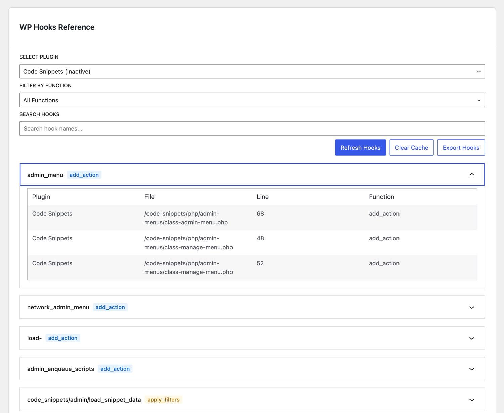

# Hooks Reference

Hooks Reference is a WordPress admin plugin that scans all installed plugins to discover where WordPress hooks (`add_action`, `do_action`, `add_filter`, `apply_filters`) are used. It provides a UI to view and filter these hooks by plugin and hook type.

> **Warning:** This is an experimental plugin I created entirely using Cursor. Even this document was added by Cursor—except for this warning. No coding involved. You might notice a few small bugs here and there.

## Screenshots



## Features

- Scans all installed plugins for WordPress hooks
- Filters hooks by plugin, type, and name
- Caches results for better performance
- Automatic cache clearing when plugins are updated
- Modern React-based admin interface

## Installation

1. Clone this repository into your WordPress plugins directory:
```bash
cd wp-content/plugins
git clone https://github.com/moon0326/wp-hooks-reference.git
```

2. Install PHP dependencies:
```bash
cd wp-hooks-reference
composer install
```

3. Install JavaScript dependencies:
```bash
npm install
```

4. Build the frontend assets:
```bash
npm run build
```

5. Activate the plugin through the WordPress admin interface.

## Usage

1. Navigate to the "Hooks Reference" menu item in the WordPress admin sidebar.
2. Use the filters to narrow down the list of hooks:
   - Filter by plugin
   - Filter by hook type (action or filter)
   - Search by hook name
3. Click the "Refresh Hooks" button to clear the cache and rescan all plugins.

## Development

### PHP Development

Run `composer install`

### JavaScript Development

The frontend is built with React and uses `@wordpress/scripts` for development. To start development:

```bash
npm start
```

This will start a development server with hot reloading.

To build for production:

```bash
npm run build
```

## Contributing

Contributions are welcome! Please feel free to submit a Pull Request. 
